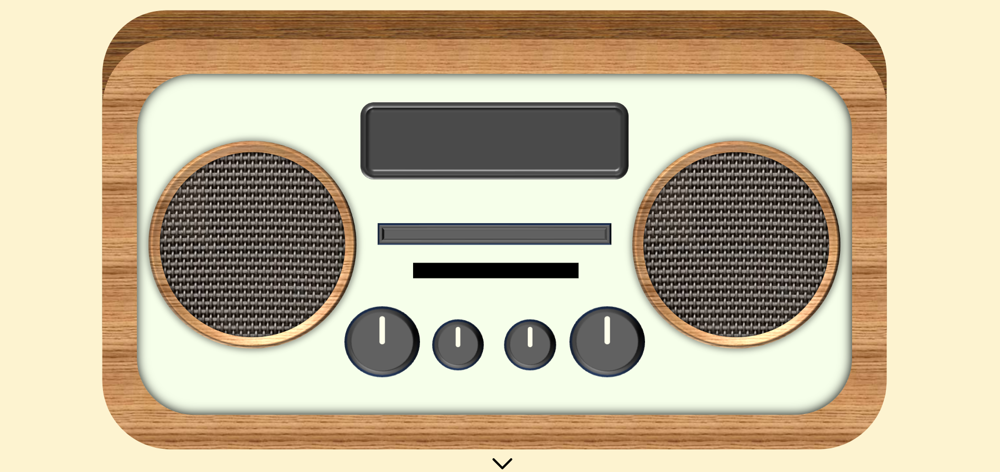
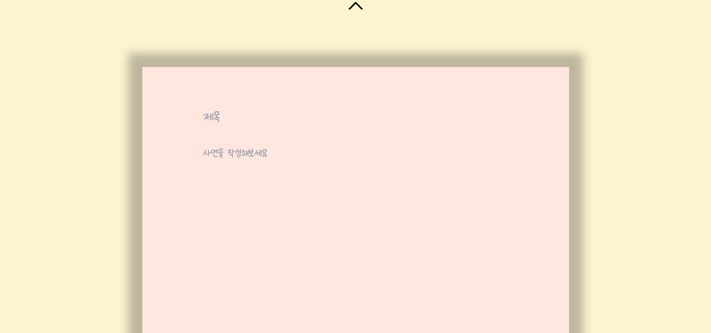
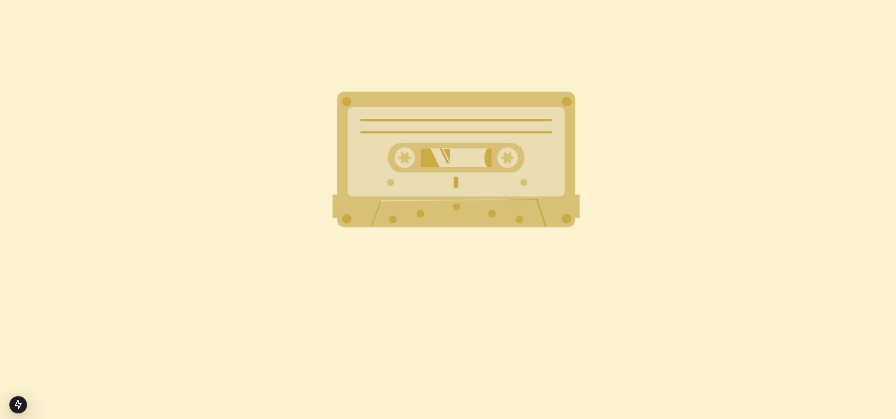
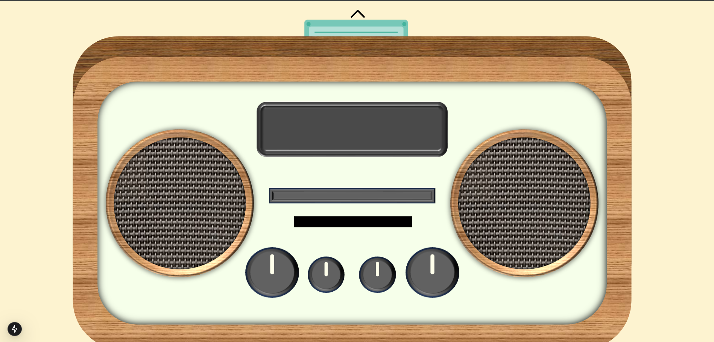

# SKYST 2025

## Starry Night By Team Cook

## Structure

1. Database: PostgreSQL at port 19880
2. Cache: Redis at port 19881
3. Server: Go Gin at port 19882
4. Web Client: Next.js at port 19883
5. Storage: Minio Object Store at port 19884

## Get Started

You can run each instance locally by running `sh .run.sh` in each module.

_Ensure that docker engine and docker compose is installed on your machine_

Additionally, public server api is provided in https://api-starrynight.luidium.com

Check API documentation in https://api-starrynight.luidium.com/docs

## 주제 선정

본 서비스에서는 레트로 감성의 서로를 나누는 라디오 인터렉티브 웹을 디자인했다. '그대에게'라는 노래를 듣고 공통적으로 느낀 심상은 레트로, 연결, 응원이라는 키워드가 있었다. 이를 바탕으로 레트로 감성을 담고 있으며 서로를 연결하고 공간적 제약에서 벗어나 언제든 '그대'와 함께 할 수 있는 매체로 라디오를 선택했다. 이를 통해 본 서비스는 사람들이 라디오의 향수를 다시 느끼고 서로의 이야기를 들으며 연결된 감각을 되찾기를 희망한다.

## 서비스 기획

본 서비스에서는 기본 화면에 라디오가 배치되어 볼륨과 채널을 버튼을 돌려 조작할 수 있다. 웹에 들어가는 순간부터 라디오가 재생되며 사용자는 언제든지 아래의 버튼을 눌러 자신의 사연을 작성할 수 있다. 위의 버튼을 누르면 자신의 사연을 녹음한 카세트테이프 라이브러리를 볼 수 있다. 이 중 하나를 택하여 라디오에서 재생할 수 있다. 사연 당사자가 아닌 모든 사용자는 라디오에서 답신을 보낼 수 있으며 사연 당사자는 다시 재생하면서 답신을 확인할 수 있다.